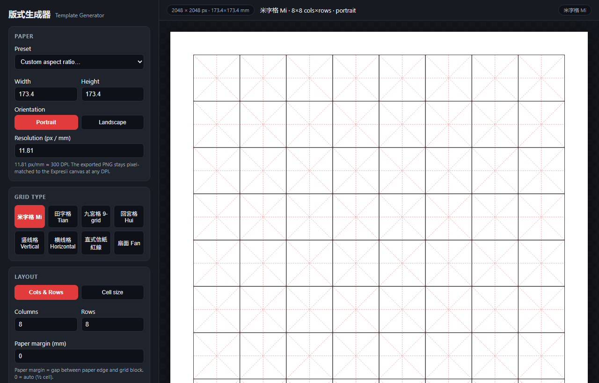

# Template Generator 版式生成器

A single-file web app for generating Chinese calligraphy practice sheets and
other layout templates (字格 / 信紙 / 扇面). It runs locally and can also send
the generated sheet straight into [Expresii Paint](https://www.expresii.com/)
as a painting underlay.



## Features

- **Template types**
  - 米字格 Mi — rice-grid (cross + diagonals)
  - 田字格 Tian — field-grid (cross)
  - 九宮格 9-grid — 3×3 sub-grid
  - 回宮格 Hui — inner box
  - 竖线格 Vertical — vertical lines only
  - 横线格 Horizontal — horizontal lines only
  - 直式信紙 紅線 — vertical Chinese letter paper: red outer frame + red
    column lines (8 full-width columns)
  - 扇面 Fan — folding-fan leaf: two concentric convex arcs + two radial ribs,
    filled with a fanned polar grid and 米字格 cell guides. A **扇面规格 (fan
    spec)** dropdown (8寸 / 9寸 / 10寸 / 自定) applies the real sector shape from
    the reference template (opened width, rib length, radial depth); the leaf fits
    the current paper, so it works with Expresii auto paper-size sync.
- **Paper**: presets (A4/A3/A5/Letter/Legal/Square), custom aspect, portrait /
  landscape, adjustable resolution (px/mm, ~300 DPI). The exported PNG stays
  pixel-matched to the Expresii canvas at any DPI.
- **Layout**: cols & rows, or cell-size; paper margin (auto = ½ cell).
- **Style**: border & guide colors, border/guide widths, dashed guides, cell
  borders.
- **Export**: SVG (vector, scales to any printer), PNG, or Print/PDF.
- **Expresii integration**: live connection status, editable server URL,
  auto paper-size sync from `/state` (2048×2048 → default 8×8 grid), and
  *Send to Expresii* (Underlay or Settled Paint).

## Running locally

The app fetches Expresii through a thin same-origin proxy (required because
Expresii's Command Server does not send CORS headers), so it must be served
over `http://`, not opened as a `file://`.

```bash
cd calligraphy_grid_app
python serve.py
# open http://127.0.0.1:8753/index.html
```

`serve.py` serves the static files and proxies `/expresii/<host>/...` to the
Expresii Command Server (default `localhost:9000`).

## Sending to Expresii

1. Make sure Expresii is running with its Command Server enabled.
2. In the **EXPRESII** panel, confirm the Server URL (default
   `http://localhost:9000`) and that it shows *connected*.
3. Pick a **Target** (Underlay / Settled Paint layer) and click **Send to
   Expresii**.

## Files

| File | Purpose |
|------|---------|
| `index.html` | The entire app (HTML + CSS + JS), self-contained. |
| `serve.py` | Local static server + Expresii CORS proxy. |
| `screenshot.png` | Screenshot shown above. |
